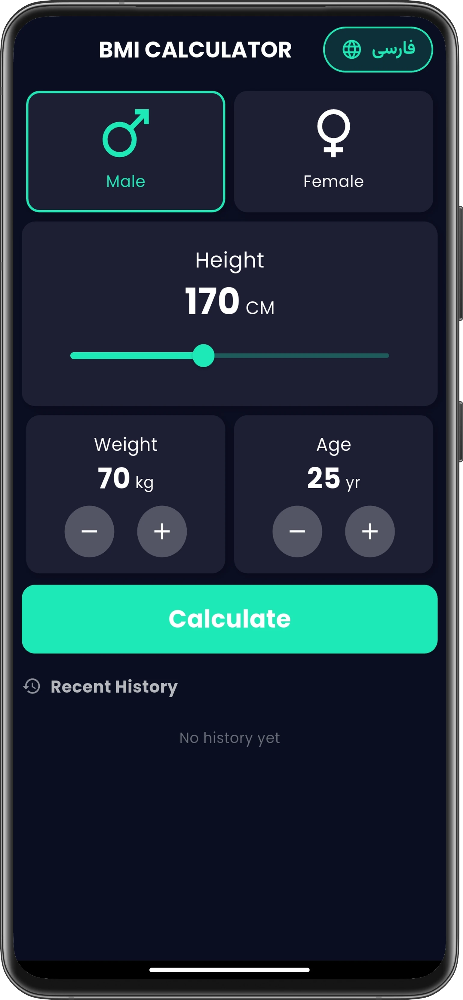
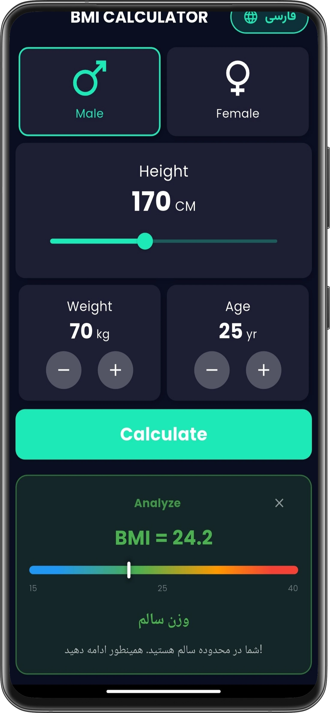
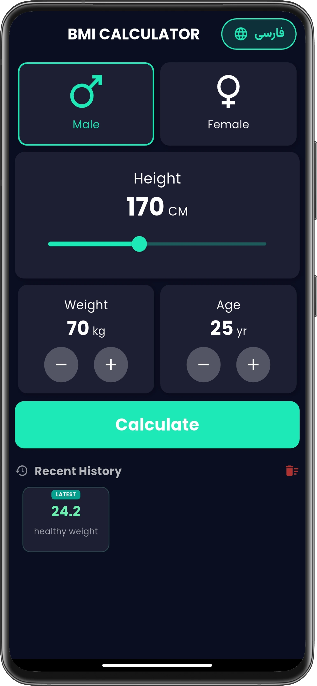
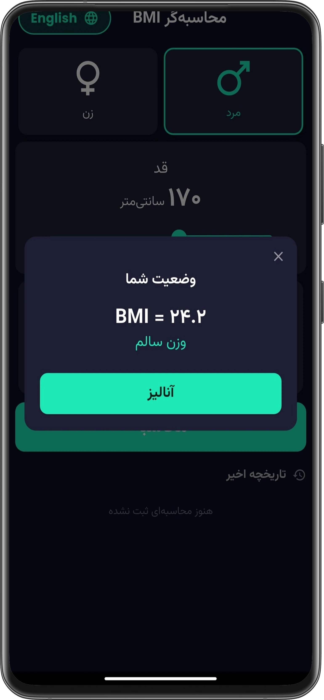
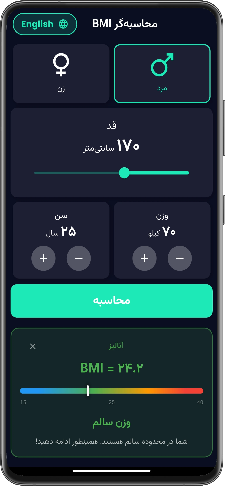
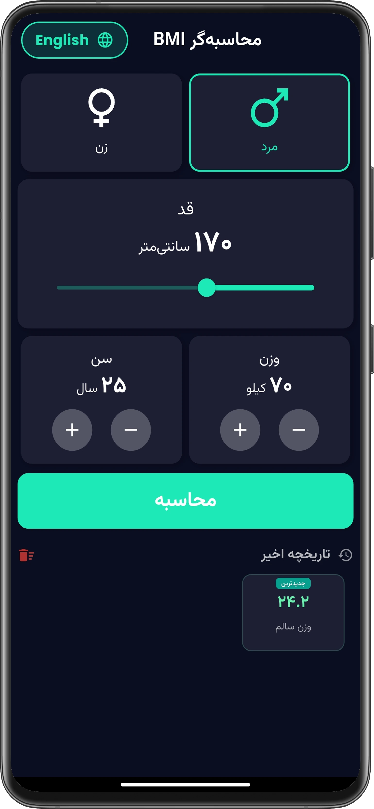

# ⚖️ BMI Calculator (Bilingual & Multi-platform)
[🇮🇷 برای مطالعه توضیحات به زبان فارسی کلیک کنید](#-فارسی)

A sleek, modern, and fully responsive Body Mass Index (BMI) calculator built with Flutter. This application provides real-time BMI calculations, smart medical advice based on age and gender, an interactive history system, and a dynamic bilingual (English/Farsi) interface.

## 📸 Screenshots (English Interface)

  
  
  

## ✨ Features

### 🎨 Core UI/UX
* Modern Material 3: Cohesive and eye-catching Dark Mode design.
* Multi-platform & PWA Ready: Fully compatible with Android, iOS, and Web. Configured as a Progressive Web App with a custom manifest.
* Responsive Web Design: Applies Max-Width constraints on large screens to maintain an optimized, "app-like" appearance.
* Smooth Animations: Utilizes AnimatedContainer and internal animations for fluid result reveals and gauge movements.

### 🌍 Localization & Formatting
* Smart Bilingual Support: Seamless real-time switching between English and Farsi with full RTL/LTR layout adaptation.
* Smart Typography: Automatically switches to Vazirmatn for Farsi and Poppins for English.
* Persian Digits: Converts all numerical inputs and results (height, weight, age, history) into Persian characters when Farsi is active.

### 🧠 Advanced BMI Logic
* High Accuracy: Calculates BMI based on global health standards.
* Visual BMI Gauge: Graphical representation of the user's status on a color spectrum (blue to red) with an animated indicator.
* Smart Medical Advice: Provides tailored analysis considering:
    - Gender: Differentiated advice for men and women.
    - Age Limits: Recognizes age boundaries (under 20 and over 60).
    - Target Weight: Calculates the exact kilograms needed to lose or gain to reach a healthy weight range.

### 🕒 Interactive History System
* Persistent Storage: Saves the last 10 calculations locally using shared_preferences.
* Interactive Records: Click on any past record to instantly reload the full result, analysis, and gauge position.
* Web UX Optimized: Supports mouse drag scrolling for horizontal history lists on the web. Includes a "Latest" badge for quick identification and a clear history option.

### ⚙️ Technical Foundation
* Clean Code Architecture: Strict separation of computational logic (BmiLogic) and utilities (BmiUtils) from the UI layer.
* Robust Error Handling: Prevents build crashes and handles invalid input values smoothly.

## 💻 Getting Started

To run this project locally, follow these steps:

1. Clone the repository:
   git clone https://github.com/AHakimDev/BMI-calculator.git

2. Navigate to the project directory:
   cd BMI-calculator

3. Install dependencies:
   flutter pub get

4. Run the app:
   flutter run

---

## 🇮🇷 فارسی
[🇬🇧 Read this in English](#️-bmi-calculator-bilingual--multi-platform)

یک اپلیکیشن زیبا، مدرن و کاملاً رسپانسیو برای محاسبه شاخص توده بدنی (BMI) که با فلاتر ساخته شده است. این برنامه محاسبه لحظه‌ای BMI، توصیه‌های پزشکی هوشمند بر اساس سن و جنسیت، سیستم تاریخچه تعاملی، و یک رابط کاربری پویای دو زبانه (انگلیسی/فارسی) را ارائه می‌دهد.

## 📸 تصاویر محیط برنامه (رابط کاربری فارسی)

  
  
  

## ✨ ویژگی‌ها و امکانات

### 🎨 ویژگی‌های عمومی و طراحی (Core UI/UX)
* طراحی مدرن Material 3: استفاده از تم تیره (Dark Mode) با رنگ‌بندی منسجم و چشم‌نواز.
* Multi-platform: سازگاری کامل با اندروید، iOS و وب.
* طراحی رسپانسیو وب: اعمال محدودیت عرض (Max Width) برای نمایش بهینه در نمایشگرهای بزرگ و حفظ ظاهر "اپ‌گونه".
* PWA Ready: آماده نصب به عنوان اپلیکیشن تحت وب با آیکون اختصاصی و Manifest تنظیم شده.
* انیمیشن‌های نرم: استفاده از AnimatedContainer و انیمیشن‌های درونی برای نمایش نتایج و حرکت نشانگرها.

### 🌍 قابلیت‌های بومی‌سازی (Localization)
* دو زبانه هوشمند: پشتیبانی کامل از فارسی و انگلیسی با تغییر لحظه‌ای تمام متون.
* مدیریت هوشمند فونت: استفاده خودکار از فونت Vazirmatn برای فارسی و Poppins برای انگلیسی.
* پشتیبانی کامل RTL/LTR: تغییر جهت چیدمان کل برنامه بر اساس زبان انتخابی.
* فارسی‌سازی اعداد: تبدیل تمام اعداد (قد، وزن، سن، نتیجه و تاریخچه) به کاراکترهای فارسی در حالت زبان فارسی برای بهبود تجربه کاربری.

### 🧠 امکانات محاسباتی و آنالیز (BMI Logic)
* دقت بالا: محاسبه BMI بر اساس استانداردهای جهانی.
* نوار وضعیت بصری (BMI Gauge): نمایش گرافیکی وضعیت کاربر روی یک نوار طیف رنگی (از آبی تا قرمز) با نشانگر متحرک.
* توصیه‌های پزشکی هوشمند: ارائه تحلیل دقیق و اختصاصی بر اساس:
    - جنسیت: توصیه‌های متفاوت برای زنان و مردان.
    - رده سنی: تشخیص محدودیت‌های سنی (زیر ۲۰ سال و بالای ۶۰ سال).
    - هدف‌گذاری وزنی: اعلام دقیق مقدار کیلوگرم مورد نیاز برای کاهش یا افزایش وزن جهت رسیدن به محدوده سلامت.

### 🕒 سیستم تاریخچه پیشرفته (Advanced History)
* ذخیره‌سازی دائمی: نگهداری ۱۰ محاسبه آخر در حافظه گوشی با استفاده از shared_preferences.
* تاریخچه تعاملی: امکان کلیک بر روی هر رکورد قدیمی برای بازخوانی کامل نتیجه، آنالیز و وضعیت نشانگر در همان لحظه.
* مدیریت لیست: قابلیت حذف کلی تاریخچه و نمایش برچسب (Badge) برای تشخیص سریع آخرین محاسبه.
* تجربه کاربری وب: فعال بودن قابلیت کشیدن با موس (Mouse Drag) و اسکرول‌بار برای لیست‌های افقی در نسخه وب.

### ⚙️ زیرساخت فنی (Technical Foundation)
* Clean Code: تفکیک کامل منطق محاسباتی (BmiLogic) و ابزارهای کمکی (BmiUtils) از لایه رابط کاربری.
* مدیریت خطا: هندل کردن مقادیر ورودی و جلوگیری از کرش‌های احتمالی در زمان بیلد.

## 💻 راهنمای اجرا

برای اجرای این پروژه روی سیستم خود، مراحل زیر را دنبال کنید:

۱. مخزن را کلون کنید:
git clone https://github.com/AHakimDev/BMI-calculator.git

۲. وارد پوشه پروژه شوید:
cd BMI-calculator

۳. پکیج‌های پیش‌نیاز را نصب کنید:
flutter pub get

۴. برنامه را اجرا کنید:
flutter run